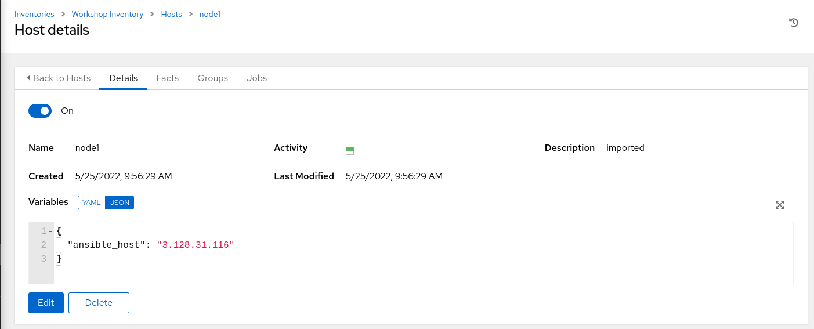
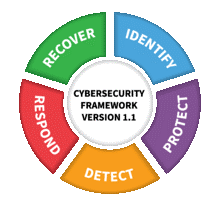

# [WIP] Ansible Workshop - Ansible for Red Hat Enterprise Linux Security Automation

**This is documentation for Ansible Automation Platform 2**

If you’re new to Ansible Automation, but want a quicker version of the original RHEL workshop, this 90-minute workshop provides you with fewer exercises, focused on cloud provisioning, converting bash/shell commands to Ansible, all the way to utilizing RHEL System Roles.

**This is documentation for Ansible Automation Platform 2**

## Table of Contents

* [Table of Contents](#table-of-contents)
* [Presentations](#presentations)
* [Time planning](#time-planning)
* [Lab Diagram](#lab-diagram)
* [Ansible Automation Platform Exercises](#ansible-automation-platform-exercises)

## Presentations

The exercises are self explanatory and guide the participants through the entire lab. All concepts are explained when they are introduced.


## Time planning

This workshop was created to last about 90 minutes.

## Lab Diagram


## Ansible Automation Platform Exercises

*************************************************************************************************

# Section 0: Introduction and Initial Setup

## Step 1 - Setup the Security Workshop Project

The lab environemnt described above will need to be configured before going through the exercises in this workshop, and to do so a playbook has been written to do the following:
* Stop `firewalld` and install, start and enable `auditd` on all the RHEL hosts.
* Install and configure `MariaDB` on `node2` (by default) to act as the backend for our sample webapp. 
    * A sample database `webapp_db` will be created, and populated with a simple table containing information on the name and version of our application. 
    * 2 users, `webapp` and `webappssl` will be created wih
        * `webapp` can connect to the database from any host and does not require an encrypted connection.
        * `webappssl` can connect to the database from only the web server and does require an encrypted connection.
    * Database will not initially be configured to use SSL
    * Databse will be configured to use a non default port , 3389
    * Database will be configured to listen for connections from All hosts
* Install and configure `Apache` and `PHP` on `node1` (by default) to act as our webserver.
    * A simple php page will be deployed to the docroot that connects to the `MariaDB` server and display the name and version of the application
    * The php page will also display information on the status of the database session with regards to the `SSL Cipher` and `SSL Version` if and only if the connection uses SSL.
    * The server listens on port 80 (http), and does not listen on 443 (https).


<br>

In order to import the setup playbook into Automation Controller, we will need to define a new project.
To start, log on to Ansible Controller using your environemnt details, click **Projects** and click on the  icon. Use the following values for your new Project:

| Key                              | Value                                                             | Note |
|----------------------------------|-------------------------------------------------------------------|------|
| Name                             | Security Workshop Project                                         |      |
| Description                      | Project containing Playbooks for the RHEL Security Workshop       |      |
| Organization                     | Default                                                           |      |
| Execution Environment            | Leave Blank                                                       |      |
| Source Control Type              | Git                                                               |      |
| Source Control URL               | Clone the URL of the git repo you are reading the instructions on |      |
| Source Control Branch/Tag/Commit | Leave Blank                                                       |      |
| Source Control Refspec           | Leave Blank                                                       |      |
| Source Control Credential        | Leave Blank                                                       |      |

Project Definition will look like this: 


click on the  icon, and you will be rediected to the project details page, and a Job will automatically be created to sync the project in Controller. Wait until the `Last Job Status` shows . If you get a failure, click the edit button, verify that you entered the project details correctly and save the project.


> **Tip**
>
> We will be setting up another project later to host the playbooks we will write during this workshop.


## Step 2 - Create the `Workshop Initial Setup` Job template


Now that the project sync is complete, Select **Templates** and click on the  icon, and select `Add Job Template`. Use the following values for your new Template:

| Key         | Value                                            | Note |
|-------------|--------------------------------------------------|------|
| Name        | Workshop Initial Setup                           |      |
| Description | Initial setup and configuration of the workshop  |      |
| Job Type    | Run                                              |      |
| Inventory   | Workshop Inventory                               |      |
| Project     | Security Workshop Project                        |      |
| Execution Environment | rhel workshop execution environment             |      |
| Playbook    | `lab-setup.yml`                |      |
| Credential  | Type: **Machine**. Name: **Workshop Credential**     |      |
| Limit       | web                                          |      |
| Options     |                                                  |      |

<br>


Click SAVE and then Click LAUNCH to run the job. The job will start running, and you will be able to see the output. Take a look at the tasks in the output panel to get an idea of what the setup playbook is doing. The job should complete successfully and you should be able to scroll through the details of the workshop configuration job output. 


The initial configuration for the workshop is now complete.

## Step 3 - Validate the setup

The lab environemnt should now be setup as descibed earlier with MariaDB and Apache running. In order to validate, we can visit the web server to see the application that was deployed. Click **Inventories**
on the left panel, and then click the name of our Inventory **Workshop Inventory**. Now that you are on the Inventory Details page, we will need to go select our Host. So click **HOSTS**, and click on **node1** since that is the webserver node (by default) and inspect the node's IP address under the `variables` section. 



> **Tip**
>
> The IP Address in your inventory will be different than the one in the screenshot above. Make sure you use the address specific to your lab environemnt.


Copy that IP address and launch a new browser windows or tab and put in `http://<NODE1's_IP_ADDRESS_YOU_JUST_COPIED>` and look at the webpage:


What you are seeing is the PHP application that was deployed, where the name of the application and its version are retrieved from the MariaDB instance installed on `node2`. There are also 2 variables on the page being shown, `Ssl_version` and `Ssl_cipher`, and both have no values being shown. These variables are showing the status of the database session signifying that the connection between the application and the database is not encrypted.

> **Tip**
>
> Find more information on  MySQL Encrypted Connection TLS Protocols and Ciphers [here](https://dev.mysql.com/doc/refman/5.7/en/encrypted-connection-protocols-ciphers.html).

Now try using `https` to access the same page by going to `https://<NODE1's_IP_ADDRESS_YOU_JUST_COPIED>`. You should get an `ERR_CONNECTION_REFUSED`. That is expected since Apache was only configured to listen for http connections.


Now that the setup is complete, we can introduce the framework that we will be using for this workshop, and that is the `NIST Cybersecurity Framework Version 1.1` as shown in the following diagram (Credit: N. Hanacek/NIST):



In this workshop, we will cover all the stages of this framework on a very small subset of requirements to convey how Ansible and the Red Hat Ansible Automation Platform could be valuable to security teams looking for a way to automate and streamline their day to day security processes and requirements.


# Section 1: IDENTIFY

In the first section we will discuss the `IDENTIFY` stage of the framework by defining the requiremnents that should be met/enforced. These requirements are going to be our target for the remainder of this workshop as we work on their enforcement.

For this workshop we will assume that the security team have highlighted the following requirements with regards to LAMP stacks:

1. **All traffic to the web application should be encrypted.**
2. **All traffic between the web application and the database should be encrypted.**


# Section 2: PROTECT

First we will define our play:

```yaml
---
- name: Install Specific versions of packages using Chocolatey
  hosts: all
  gather_facts: false
  vars:
    choco_packages:
      - name: nodejs
        version: 13.0.0
      - name: python
        version: 3.6.0
```

Since we will not need or use any of the facts gathered by Ansible,  we have disabled fact gathering by setting `gather_facts: false` to decrease overhead. We also defined one dictionary variable named `choco_packages` under the `vars` directive to hold the names and versions of the packages we want to install using Chocolatey.

Next we will add our tasks:


```yaml
  tasks:

  - name: Install specific versions of packages sequentially
    chocolatey.chocolatey.win_chocolatey:
      name: "{{ item.name }}"
      version: "{{ item.version }}"
    loop: "{{ choco_packages }}"

  - name: Check python version
    ansible.windows.win_command: python --version
    register: check_python_version

  - name: Check nodejs version
    ansible.windows.win_command: node --version
    register: check_node_version

  - ansible.builtin.debug:
      msg: Python Version is {{ check_python_version.stdout_lines[0] }} and NodeJS version is {{ check_node_version.stdout_lines[0] }}
```


We added 4 tasks to the tasks section:

* The first task uses the `win_chocolatey` module from the `chocolatey.chocolatey` collection, and will loop over the `choco_packages` variable to install each product with the specified version
* The second and third tasks use the `win_command` module from the `ansible.windows` collection to execute commands to check the version of `python` and `node` respectively, registering the output of each.
* The fourth and final task used the `debug` module from the `ansible.builtin` collection to display a message containing the information gathered in steps 2 and 3.

> **Tip**
>
> The `win_chocolatey` module's `name` attribute can actually take a list of packages avoiding the need for a loop, however using a loop will allow you to specify the versions of each package, and install them sequentially if order is relevant. for more information on the `win_chocolatey` module take a look at the [docs](https://docs.ansible.com/ansible/latest/collections/chocolatey/chocolatey/win_chocolatey_module.html).

# Section 3: DETECT

# Section 4: RESPOND

# Section 5: RECOVER
---

